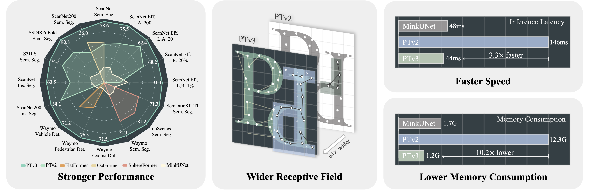

# Point Transformer V3
[](https://paperswithcode.com/sota/lidar-semantic-segmentation-on-nuscenes?p=point-transformer-v3-simpler-faster-stronger)  
[](https://paperswithcode.com/sota/semantic-segmentation-on-s3dis?p=point-transformer-v3-simpler-faster-stronger)  
[](https://paperswithcode.com/sota/semantic-segmentation-on-scannet?p=point-transformer-v3-simpler-faster-stronger)  
[](https://paperswithcode.com/sota/3d-semantic-segmentation-on-scannet200?p=point-transformer-v3-simpler-faster-stronger)  
[](https://paperswithcode.com/sota/3d-semantic-segmentation-on-semantickitti?p=point-transformer-v3-simpler-faster-stronger)  

This repo is the official project repository of the paper **_Point Transformer V3: Simpler, Faster, Stronger_** and is mainly used for releasing schedules, updating instructions, sharing experiment records (containing model weight), and handling issues. The code will be updated in _[Pointcept](https://github.com/Pointcept/Pointcept) v1.5_.  
[ Backbone ] [PTv3] - [ [arXiv](https://arxiv.org/abs/2312.10035) ] [ [Bib](https://xywu.me/research/ptv3/bib.txt) ] [ [Code](https://github.com/Pointcept/Pointcept) ]  

<div align='left'>

</div>

## Highlights
- *Apr 05, 2024*: PTv3 is selected as one of the 90 **Oral** presentations (3.3% accepted paper, 0.78% submissions) by CVPR'24!
- *Feb 28, 2024*: PTv3 is accepted by CVPR'24 🎉🎉🎉. 
- *Dec 31, 2023*: We released the model code of PTv3, experiment records for scratched ScanNet and ScanNet200 are now available. More will be available soon.
- *Dec 19, 2023*: We released our project repo for PTv3, if you have any questions related to our work, please feel free to open an issue. Subscribe to our updates by filling out the [form](https://forms.gle/jHoBNqfhqK94WG678) and the subscription can be canceled by editing the form.


## Overview
- [Schedule](#schedule)
- [Citation](#citation)
- [Installation](#installation)
- [Data Preparation](#data-preparation)
- [Quick Start](#quick-start)
- [Model Zoo](#model-zoo)


## Schedule
To make our polished code and reproduced experiments available as soon as possible, this time we will release what we already finished immediately after a validation instead of releasing them together after all work is done. We list a task list as follows:

- [x] Release model code of PTv3;
- [x] Release scratched config and record of indoor semantic segmentation;
  - [x] ScanNet
  - [x] ScanNet200
  - [x] S3DIS
  - [x] S3DIS 6-Fold (with cross-validation script) 
- [ ] Release pre-trained config and record of indoor semantic segmentation;
  - [x] ScanNet (ScanNet + S3DIS + Structured3D)
  - [ ] ScanNet200 (Fine-tuned from above)
  - [x] S3DIS (ScanNet + S3DIS + Structured3D)
  - [x] S3DIS 6-Fold (Fine-tuned from ScanNet + Structured3D)
- [ ] Release scratched config and record of outdoor semantic segmentation;
  - [x] NuScenes
  - [ ] SemanticKITTI
  - [x] Waymo
- [ ] Release pre-trained config and record of outdoor semantic segmentation;
  - [ ] NuScenes (NuScenes + SemanticKITTI + Waymo)
  - [ ] SemanticKITTI (NuScenes + SemanticKITTI + Waymo)
  - [ ] Waymo (NuScenes + SemanticKITTI + Waymo)
- [ ] Release config and record of indoor instance segmentation;
  - [ ] ScanNet (Scratch and Fine-tuned from PPT pre-trained PTv3)
  - [ ] ScanNet200 (Scratch and Fine-tuned from PPT pre-trained PTv3)
- [ ] Release config and record of ScanNet data efficient benchmark;
- [ ] Release config and record of Waymo Object Detection benchmark;
- [ ] Release config and record of ImageNet classification;
  - [ ] ImageClassifier (making all 3D backbones in Pointcept support image classification)
  - [ ] Config and Record (PTv3 + SparseUNet)

## Citation
If you find _PTv3_ useful to your research, please cite our work as an acknowledgment. (੭ˊ꒳​ˋ)੭✧
```bib
@inproceedings{wu2024ptv3,
    title={Point Transformer V3: Simpler, Faster, Stronger},
    author={Wu, Xiaoyang and Jiang, Li and Wang, Peng-Shuai and Liu, Zhijian and Liu, Xihui and Qiao, Yu and Ouyang, Wanli and He, Tong and Zhao, Hengshuang},
    booktitle={CVPR},
    year={2024}
}

@inproceedings{wu2024ppt,
    title={Towards Large-scale 3D Representation Learning with Multi-dataset Point Prompt Training},
    author={Wu, Xiaoyang and Tian, Zhuotao and Wen, Xin and Peng, Bohao and Liu, Xihui and Yu, Kaicheng and Zhao, Hengshuang},
    booktitle={CVPR},
    year={2024}
}

@inproceedings{wu2022ptv2,
    title={Point transformer V2: Grouped Vector Attention and Partition-based Pooling},
    author={Wu, Xiaoyang and Lao, Yixing and Jiang, Li and Liu, Xihui and Zhao, Hengshuang},
    booktitle={NeurIPS},
    year={2022}
}

@misc{pointcept2023,
    title={Pointcept: A Codebase for Point Cloud Perception Research},
    author={Pointcept Contributors},
    howpublished={\url{https://github.com/Pointcept/Pointcept}},
    year={2023}
}
```

## Installation

### Requirements
 PTv3 relies on FlashAttention, while FlashAttention relies on the following requirement, make sure your local Pointcept environment satisfies the requirements:

(Recommendation)
- Ubuntu: 20.04 and above
- CUDA: 11.6 and above
- PyTorch: 1.12.0 and above

If you can not upgrade your local environment to satisfy the above-recommended requirements, the following requirement is the minimum to run PTv3 with Pointcept, and you need to disable Flash Attention to enable PTv3:

(Minimum)
- Ubuntu: 18.04 and above
- CUDA: 11.3 and above
- PyTorch: 1.10.0 and above

### Environment

- Base environment
```bash
conda create -n pointcept python=3.8 -y
conda activate pointcept
conda install ninja -y
# Choose version you want here: https://pytorch.org/get-started/previous-versions/
# We use CUDA 11.8 and PyTorch 2.1.0 for our development of PTv3
conda install pytorch==2.1.0 torchvision==0.16.0 torchaudio==2.1.0 pytorch-cuda=11.8 -c pytorch -c nvidia
conda install h5py pyyaml -c anaconda -y
conda install sharedarray tensorboard tensorboardx yapf addict einops scipy plyfile termcolor timm -c conda-forge -y
conda install pytorch-cluster pytorch-scatter pytorch-sparse -c pyg -y
pip install torch-geometric

cd libs/pointops
python setup.py install
cd ../..

# spconv (SparseUNet)
# refer https://github.com/traveller59/spconv
pip install spconv-cu118  # choose version match your local cuda version

# Open3D (visualization, optional)
pip install open3d
```

- Flash Attention

Following [README](https://github.com/Dao-AILab/flash-attention?tab=readme-ov-file#installation-and-features) in Flash Attention repo and install Flash Attention for PTv3. This installation is optional, but we recommend enabling Flash Attention for PTv3.


## Data Preparation
Please further refer Pointcept readme [Data Preparation](https://github.com/Pointcept/Pointcept#data-preparation) section.

## Quick Start
### Two running scenarios
We provide two running scenarios for PTv3, Pointcept-driven and custom-framework-driven. For the former one, you only need to clone the code of Pointcept to your local and follow the [Quick Start](https://github.com/Pointcept/Pointcept#quick-start) in Pointcept to run PTv3:
```bash
git clone https://github.com/Pointcept/Pointcept.git
sh scripts/train.sh -p ${INTERPRETER_PATH} -g ${NUM_GPU} -d ${DATASET_NAME} -c ${CONFIG_NAME} -n ${EXP_NAME}
```
For the latter scenario, we offer a distinct instance of PTv3, disassociated from our Pointcept framework. To incorporate this code into your project, clone the project repo and copy the following file/folder to your project:
```bash
git clone https://github.com/Pointcept/PointTransformerV3.git
cp model.py ${PATH_TO_YOUR_PROJECT}
cp -r serialization ${PATH_TO_YOUR_PROJECT}
```
Align the input dictionary defined in our [model](https://github.com/Pointcept/PointTransformerV3/blob/dev/model.py#L968) file and the model will return the encoded feature of the given batch point cloud.

### Flash Attention
The full PTv3 relies on Flash Attention, while Flash Attention relies on CUDA 11.6 and above, make sure your local Pointcept environment satisfies the requirements.

If you can not upgrade your local environment to satisfy the requirements (CUDA >= 11.6), then you can disable FlashAttention by setting the model parameter `enable_flash` to `false` and reducing the `enc_patch_size` and `dec_patch_size` to a level (e.g. 128).

FlashAttention force disables RPE and forces the accuracy reduced to fp16. If you require these features, please disable `enable_flash` and adjust `enable_rpe`, `upcast_attention` and`upcast_softmax`.


## Model Zoo
### 1. Indoor semantic segmentation
| Model | Benchmark | Additional Data | Num GPUs | Val mIoU | Config | Tensorboard | Exp Record |
| :---: | :---: |:---------------:| :---: | :---: | :---: | :---: | :---: |
| PTv3 | ScanNet |     &cross;     | 4 | 77.6% | [link](https://github.com/Pointcept/Pointcept/blob/main/configs/scannet/semseg-pt-v3m1-0-base.py) | [link](https://huggingface.co/Pointcept/PointTransformerV3/tensorboard) | [link](https://huggingface.co/Pointcept/PointTransformerV3/tree/main/scannet-semseg-pt-v3m1-0-base) |
| PTv3 + PPT | ScanNet |     &check;     | 8 | 78.5% | [link](https://github.com/Pointcept/Pointcept/blob/main/configs/scannet/semseg-pt-v3m1-1-ppt-extreme.py) | [link](https://huggingface.co/Pointcept/PointTransformerV3/tensorboard) | [link](https://huggingface.co/Pointcept/PointTransformerV3/tree/main/scannet-semseg-pt-v3m1-1-ppt-extreme) |
| PTv3 | ScanNet200 |     &cross;     | 4 | 35.3% | [link](https://github.com/Pointcept/Pointcept/blob/main/configs/scannet200/semseg-pt-v3m1-0-base.py) | [link](https://huggingface.co/Pointcept/PointTransformerV3/tensorboard) |[link](https://huggingface.co/Pointcept/PointTransformerV3/tree/main/scannet200-semseg-pt-v3m1-0-base)|
| PTv3 + PPT | ScanNet200 | &check; (f.t.)  | 4 |  |  |  |  |
| PTv3 | S3DIS (Area5) |     &cross;     | 4 | 73.6% | [link](https://github.com/Pointcept/Pointcept/blob/main/configs/s3dis/semseg-pt-v3m1-0-rpe.py) | [link](https://huggingface.co/Pointcept/PointTransformerV3/tensorboard) | [link](https://huggingface.co/Pointcept/PointTransformerV3/tree/main/s3dis-semseg-pt-v3m1-0-rpe) |
| PTv3 + PPT | S3DIS (Area5) |     &check;     | 8 | 75.4% | [link](https://github.com/Pointcept/Pointcept/blob/main/configs/s3dis/semseg-pt-v3m1-1-ppt-extreme.py) | [link](https://huggingface.co/Pointcept/PointTransformerV3/tensorboard) | [link](https://huggingface.co/Pointcept/PointTransformerV3/tree/main/s3dis-semseg-pt-v3m1-1-ppt-extreme) |

_**\*Released model weights are temporarily invalid as the model structure of PTv3 is adjusted.**_

Example running scripts are as follows:
```bash
# Scratched ScanNet
sh scripts/train.sh -g 4 -d scannet -c semseg-pt-v3m1-0-base -n semseg-pt-v3m1-0-base
# PPT joint training (ScanNet + Structured3D) and evaluate in ScanNet
sh scripts/train.sh -g 8 -d scannet -c semseg-pt-v3m1-1-ppt-extreme -n semseg-pt-v3m1-1-ppt-extreme

# Scratched ScanNet200
sh scripts/train.sh -g 4 -d scannet200 -c semseg-pt-v3m1-0-base -n semseg-pt-v3m1-0-base
# Fine-tuning from  PPT joint training (ScanNet + Structured3D) with ScanNet200
# TODO

# Scratched S3DIS, S3DIS rely on RPE, also an example for disable flash attention
sh scripts/train.sh -g 4 -d s3dis -c semseg-pt-v3m1-0-rpe -n semseg-pt-v3m1-0-rpe
# PPT joint training (ScanNet + S3DIS + Structured3D) and evaluate in ScanNet
sh scripts/train.sh -g 8 -d s3dis -c semseg-pt-v3m1-1-ppt-extreme -n semseg-pt-v3m1-1-ppt-extreme

# More configs and exp records for PTv3 will be available soon.
```

### 2.Outdoor semantic segmentation
| Model | Benchmark | Additional Data | Num GPUs | Val mIoU | Config | Tensorboard | Exp Record |
| :---: | :---: | :---: | :---: | :---: | :---: | :---: | :---: |
| PTv3 | nuScenes | &cross; | 4 | 80.3 | [link](https://github.com/Pointcept/Pointcept/blob/main/configs/nuscenes/semseg-pt-v3m1-0-base.py) | [link](https://huggingface.co/Pointcept/PointTransformerV3/tensorboard)|[link](https://huggingface.co/Pointcept/PointTransformerV3/tree/main/nuscenes-semseg-pt-v3m1-0-base) |
| PTv3 + PPT | nuScenes | &check; | 8 | | | | |
| PTv3 | SemanticKITTI | &cross; | 4 | | | | |
| PTv3 + PPT | SemanticKITTI | &check; | 8 | | | | |
| PTv3 | Waymo | &cross; | 4 | 71.2 | [link](https://github.com/Pointcept/Pointcept/blob/main/configs/waymo/semseg-pt-v3m1-0-base.py) | [link](https://huggingface.co/Pointcept/PointTransformerV3/tensorboard) | [link](https://huggingface.co/Pointcept/PointTransformerV3/tree/main/waymo-semseg-pt-v3m1-0-base) (log only) |
| PTv3 + PPT | Waymo | &check; | 8 | | | | |

_**\*Released model weights are temporarily invalid as the model structure of PTv3 is adjusted.**_  
_**\*Model weights trained with Waymo Open Dataset cannot be released due to the regulations.**_

Example running scripts are as follows:
```bash
# Scratched ScanNet
sh scripts/train.sh -g 4 -d scannet -c semseg-pt-v3m1-0-base -n semseg-pt-v3m1-0-base
# PPT joint training (ScanNet + Structured3D) and evaluate in ScanNet
sh scripts/train.sh -g 8 -d scannet -c semseg-pt-v3m1-1-ppt-extreme -n semseg-pt-v3m1-1-ppt-extreme

# Scratched ScanNet200
sh scripts/train.sh -g 4 -d scannet200 -c semseg-pt-v3m1-0-base -n semseg-pt-v3m1-0-base
# Fine-tuning from  PPT joint training (ScanNet + Structured3D) with ScanNet200
# TODO

# Scratched S3DIS, S3DIS rely on RPE, also an example for disable flash attention
sh scripts/train.sh -g 4 -d s3dis -c semseg-pt-v3m1-0-rpe -n semseg-pt-v3m1-0-rpe
# PPT joint training (ScanNet + S3DIS + Structured3D) and evaluate in ScanNet
sh scripts/train.sh -g 8 -d s3dis -c semseg-pt-v3m1-1-ppt-extreme -n semseg-pt-v3m1-1-ppt-extreme
# S3DIS 6-fold cross validation
# 1. The default configs are evaluated on Area_5, modify the "data.train.split", "data.val.split", and "data.test.split" to make the config evaluated on Area_1 ~ Area_6 respectively.
# 2. Train and evaluate the model on each split of areas and gather result files located in "exp/s3dis/EXP_NAME/result/Area_x.pth" in one single folder, noted as RECORD_FOLDER.
# 3. Run the following script to get S3DIS 6-fold cross validation performance:
export PYTHONPATH=./
python tools/test_s3dis_6fold.py --record_root ${RECORD_FOLDER}

# Scratched nuScenes
sh scripts/train.sh -g 4 -d nuscenes -c semseg-pt-v3m1-0-base -n semseg-pt-v3m1-0-base
# Scratched Waymo
sh scripts/train.sh -g 4 -d waymo -c semseg-pt-v3m1-0-base -n semseg-pt-v3m1-0-base

# More configs and exp records for PTv3 will be available soon.
```
